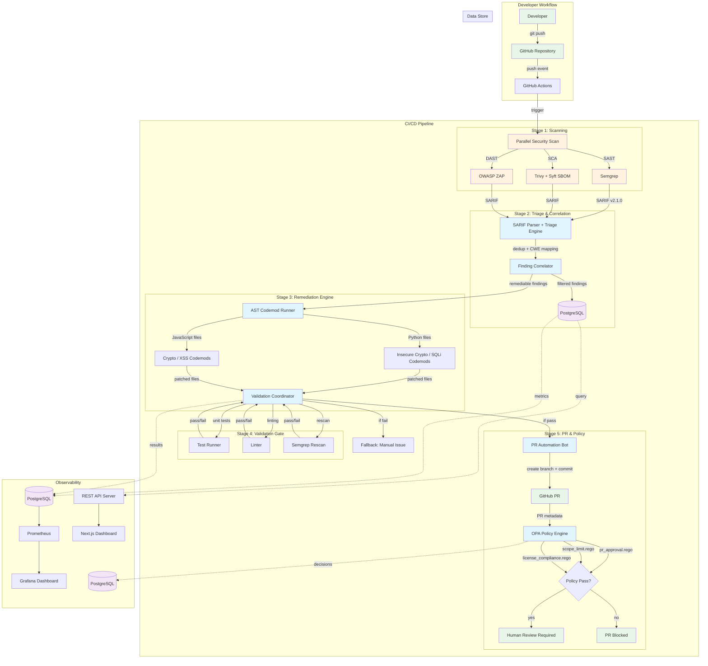

# System Architecture

## Architecture Diagram

## Component Interactions

### 1. Scan Stage (Parallel)
- **Semgrep**: SAST scanning with OWASP Top 10 + CWE Top 25 rules
- **Trivy**: SCA scanning for vulnerable dependencies + SBOM generation via Syft
- **ZAP**: DAST scanning for running applications (optional, schedule-only)
- All scanners output SARIF v2.1.0 format for unified downstream processing
- **Security constraint**: No external network access except internal artifact registry

### 2. Triage Stage
- **SARIF Parser** (`internal/sarif/`): Normalizes SARIF into unified `models.Finding`
  - Extracts: file path, line numbers, rule IDs, severity, code snippets
  - Maps rule IDs → CWE identifiers via built-in dictionary
  - Generates deterministic fingerprints (SHA-256 of file + rule + line + code)
- **Deduplicator** (`internal/triage/dedup.go`): Removes duplicate findings across scanners
  - Uses fingerprint comparison; keeps first occurrence
- **Correlator** (`internal/triage/correlator.go`): Cross-references findings from multiple scanners
  - Boosts confidence when 2+ scanners detect the same issue
  - Groups findings by file and CWE for efficient review

### 3. Remediation Stage
- **Codemod Runner** (`cmd/remediation-runner/`): Orchestrates AST transformations
  - Maps finding rule IDs → codemod scripts via registry
  - Executes language-specific codemods (Python/JavaScript)
  - Records all changes for audit trail
- **Codemods** (`codemods/`):
  - `python/insecure_crypto.py`: `hashlib.md5()`/`hashlib.sha1()` → `hashlib.sha256()`
  - `python/sql_injection.py`: String concatenation → parameterized queries
  - `javascript/insecure_crypto.js`: `createHash('md5')` → `createHash('sha256')`
  - `javascript/xss_sanitization.js`: `innerHTML` → `textContent`, `eval()` → blocked
- **Security constraint**: Deterministic-only by default; LLM fallback disabled in production

### 4. Validation Stage
- **Test Runner**: Detects project type (Go/Node.js/Python) and runs appropriate test suite
- **Linter**: Runs `go vet` / ESLint / Ruff based on project type
- **Rescan**: Runs lightweight Semgrep scan only on modified files
- **Rollback**: If any check fails, patches are reverted via `git checkout -- .`

### 5. PR & Policy Stage
- **PR Bot** (`cmd/prbot/`): Creates structured PRs
  - Branch naming: `auto-fix/security-<timestamp>`
  - Commit message includes fix summary, file table, and pipeline metadata
  - PR body contains change table, validation checklist, and human review notice
- **OPA Policies** (`policies/`):
  - `pr_approval.rego`: File/line limits, required labels, branch protection
  - `scope_limit.rego`: Blocks modifications to config, migration, and secrets files
  - `license_compliance.rego`: Blocks GPL/AGPL dependencies
  - `violation_report.rego`: Formats violations for SIEM/audit export

## Design Decisions & Trade-offs

### Why Go for Backend Services?
- **Concurrency**: Goroutines for parallel SARIF parsing and codemod execution
- **Single binary**: No runtime dependencies in container images
- **Type safety**: Compile-time checks reduce runtime errors in pipeline logic
- **Trade-off**: Longer development time vs Python, but better production reliability

### Why AST over Regex for Codemods?
- **Precision**: AST understands code structure; regex cannot distinguish between string literals and actual function calls
- **Safety**: Deterministic transformations with zero false positives on structural matches
- **Trade-off**: Requires Tree-sitter parser installation; regex fallback available but less accurate

### Why SARIF as Intermediate Format?
- **Standardization**: OASIS standard supported by Semgrep, GitHub CodeQL, ESLint, and others
- **Interoperability**: Single parser handles all scanner outputs; no per-scanner adapters needed
- **Trade-off**: ZAP doesn't natively output SARIF; requires conversion step

### Why OPA for Policy?
- **Declarative**: Rego is purpose-built for policy evaluation; cleaner than embedding policy in Go
- **Auditability**: Policy decisions are JSON-serializable for logging and review
- **Trade-off**: Additional service to deploy; but can run as sidecar via Docker Compose

### Why PostgreSQL?
- **JSONB support**: Policy decisions and SARIF data stored as JSON with GIN indexes
- **Array types**: CWE and CVE arrays for multi-value vulnerability classifications
- **Partial indexes**: Efficient queries for "find all high-severity new findings"
- **Trade-off**: Heavier than SQLite; but required for production concurrent access
